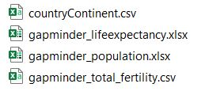

# Gapminder

# Goal
This project goal is to visualize how fertility rate decreased over the year with respect to population.

## [Dataset description](https://github.com/rashed2940/gapminder/tree/main/data):
From the given dataset, we have multiple csv files those contains countrywise population,life-expectency, fertility and their continent details for each year. 

  

