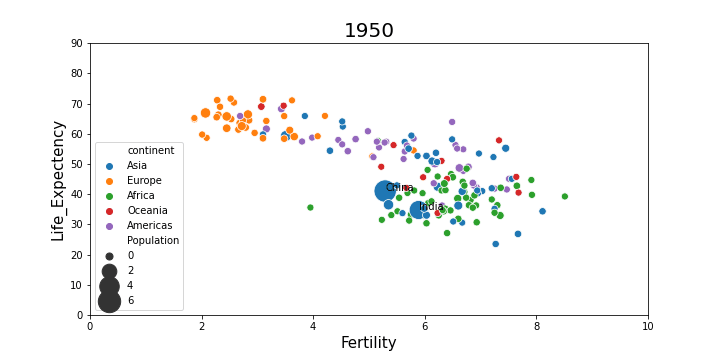

# Gapminder

## Goal
This project goal is to visualize how fertility rate decreased over the year with respect to life Expectency.

## [Dataset description](https://github.com/rashed2940/gapminder/tree/main/data):
From the given dataset, we have multiple csv files those contains countrywise population, life-expectency, fertility and their continent details for each year. 

  

## Simulation:
In this simulation, we visualized how an interactive chart is able to tell a story.
Below simulation, each country is independently represented by its unique color.

  

In this simulation, each country are represented with its continent defined unique colors.

  

